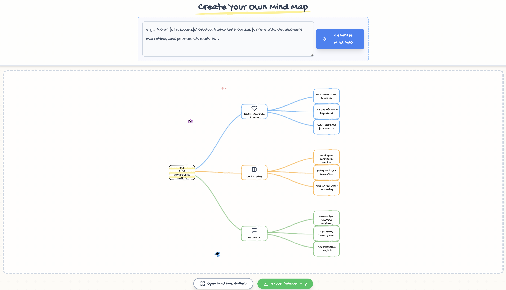

# Visual Mind Map Generator

A powerful and creative tool for generating beautiful, hand-drawn "sketchnote" style mind maps. Whether you're brainstorming a new project, studying a complex topic, or organizing your thoughts, this application helps you visualize your ideas in an engaging and memorable way. Simply describe your topic, and let the AI bring it to life.


This project is tested with BrowserStack.
## Why This Tool is Useful

In a world of information overload, visualizing complex ideas is more important than ever. Standard diagrams can be sterile and uninspiring. This tool was built to bridge that gap, offering a unique "sketchnote" aesthetic that makes learning and brainstorming more creative and fun.

This project also serves as a practical demonstration of:
- **Creative AI Applications:** Using the Google Gemini API to transform natural language into structured, hierarchical data (JSON).
- **Interactive Data Visualization:** Leveraging the power of D3.js to create dynamic, aesthetically pleasing, and customizable diagrams.
- **Modern Frontend Development:** Combining React, TypeScript, and Tailwind CSS to build a responsive and robust user experience.

## Features

- **🎨 Sketchnote Aesthetic:** A unique, hand-drawn visual style for nodes, links, and icons that makes complex information feel approachable and memorable.
- **🧠 AI-Powered Creation:** Simply describe any topic, and the app uses the Google Gemini API to instantly generate a structured, hierarchical mind map for you.
- **🗺️ Interactive Canvas:** Pan and zoom through your mind maps with smooth, intuitive controls.
- **👋 Fully Customizable:** Customize the layout by dragging nodes and decorative doodles to your preferred positions. Your changes are saved automatically.
- **🖼️ High-Quality PNG Export:** Download any mind map as a high-resolution PNG image, perfect for presentations, reports, or study notes.
- **📚 Example Gallery:** Get inspired with a collection of pre-built mind maps covering various business and tech domains. (The initial examples are based on concepts from a Google Cloud article on GenAI.)

## Tech Stack

- **Frontend:** [React](https://reactjs.org/) & [TypeScript](https://www.typescriptlang.org/)
- **Visualization:** [D3.js](https://d3js.org/)
- **AI Model:** [Google Gemini API (`@google/genai`)](https://ai.google.dev/docs)
- **Styling:** [Tailwind CSS](https://tailwindcss.com/)

## Getting Started

This project is a client-side, static web application designed to run in an environment that provides secrets as global variables.

### Prerequisites

- A hosting environment that injects environment variables into the client-side code (e.g., Vercel, Netlify, or a custom setup).
- A **Google Gemini API Key**. You can get one from [Google AI Studio](https://aistudio.google.com/).

### Configuration

The application requires your Google Gemini API key to function. The code in `App.tsx` expects this key to be available at `process.env.GEMINI_API_KEY`.

You must configure your deployment environment to set this variable. For example, in hosting providers like Vercel or Netlify, you would add an environment variable named `GEMINI_API_KEY` with your key's value. The platform will then make this available to the application's runtime.

Without this configuration, the AI-powered generation feature will not work.

### Running the Application

Once you have a hosting environment configured with the `API_KEY` variable, simply deploy the contents of this project's directory. The `index.html` file is the entry point.

### Running Locally

1. Clone the repository.
2. Install the dependencies:
   ```bash
   npm install
   ```
3. Create a `.env` file in the root of the project and add your Google Gemini API key as follows:
   ```
   GEMINI_API_KEY=YOUR_API_KEY
   ```
4. Start the development server:
   ```bash
   npm run dev
   ```
5. Open your browser and navigate to the URL provided by Vite (usually `http://localhost:5173`).

## How to Use the App

1.  **Generate a Mind Map:**
    -   In the text box at the top, type a clear description of the mind map you want to create.
    -   *Example: "A plan for a successful product launch with phases for research, development, marketing, and post-launch analysis."*
    -   Click the **"Generate Mind Map"** button. The app will send your request to the Gemini API and render the result on the canvas.

2.  **Explore the Gallery:**
    -   Click the **"Open Mind Map Gallery"** button.
    -   Select any of the pre-built examples to load it onto the canvas.

3.  **Interact with the Canvas:**
    -   **Pan:** Click and drag on any empty area of the canvas.
    -   **Zoom:** Use your mouse wheel or trackpad to zoom in and out.
    -   **Reposition:** Click and drag any node or decorative doodle to move it. The connecting lines will adjust automatically.

4.  **Export Your Map:**
    -   With a mind map loaded on the canvas, click the **"Export Selected Map"** button.
    -   You will be taken to a preview page.
    -   Click **"Download PNG"** to save a high-quality image of your mind map to your computer.

## Project Structure

```
.
├── components/          # React components
│   ├── GalleryModal.tsx # Modal for browsing pre-built maps
│   ├── Icons.tsx        # SVG icon components
│   ├── MindMap.tsx      # Core D3.js and React component for rendering the mind map
│   └── PrintLayout.tsx  # Layout for the export/print preview
├── data.ts              # Data for the pre-built gallery mind maps
├── types.ts             # TypeScript type definitions
├── App.tsx              # Main application component
├── index.html           # The entry point of the application
├── index.tsx            # React root renderer
└── metadata.json        # Project metadata
```

## Contributing

Contributions are welcome! If you have ideas for new features, improvements, or bug fixes, please feel free to open an issue or submit a pull request.

1.  Fork the repository.
2.  Create a new branch (`git checkout -b feature/your-feature-name`).
3.  Make your changes.
4.  Commit your changes (`git commit -m 'Add some feature'`).
5.  Push to the branch (`git push origin feature/your-feature-name`).
6.  Open a new Pull Request.
